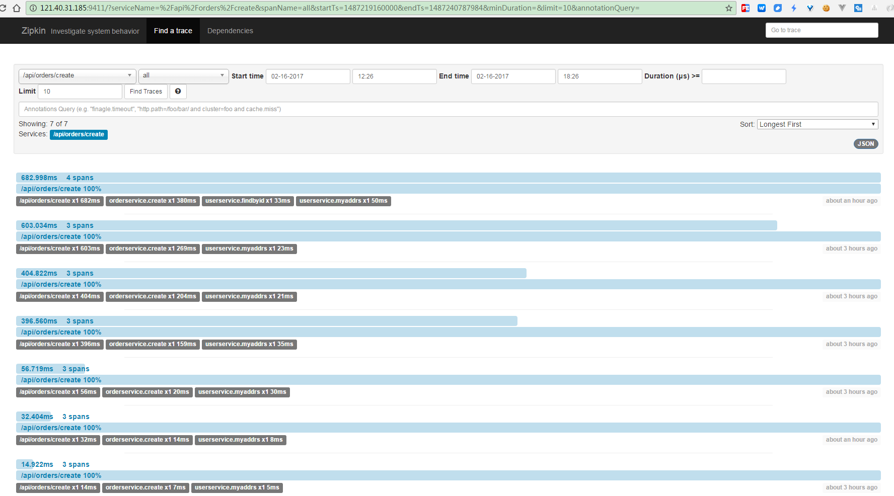
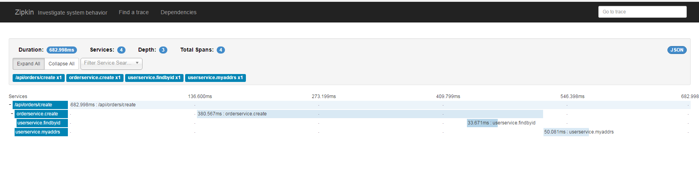
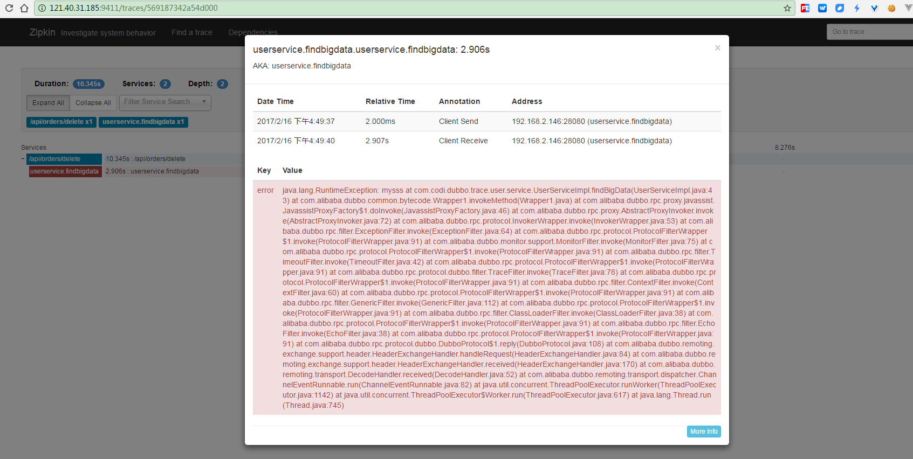

## Dubbo-trace

### Overview







### Config

#### 配置pom.xml

````
    <dependency>
        <groupId>com.codi</groupId>
        <artifactId>dubbo-trace-core</artifactId>
    </dependency>
````

#### 配置web.xml
````
    <filter>
        <filter-name>traceFilter</filter-name>
        <filter-class>com.codi.superman.dubbo.trace.core.filter.TraceHttpFilter</filter-class>
    </filter>
    <filter-mapping>
        <filter-name>traceFilter</filter-name>
        <url-pattern>/*</url-pattern>
    </filter-mapping>
````

### 配置spring-dubbo-consumer.xml、spring-dubbo-provider.xml
dubbo的接入配置不在文档中
````
    <dubbo:consumer filter="TraceConsumerFilter"/>
    <dubbo:provider filter="TraceProviderFilter"/>
````

### 配置CODI_HOME/dubbo.properties
````
#【是否开启服务跟踪】
dubbo.codi.trace.enable=true
#【zipkin Server url】
dubbo.codi.trace.address=http://121.40.31.185:9411/
dubbo.codi.trace.appName=TestApp
dubbo.codi.trace.appOwner=spy
#【需要监控的请求地址,用逗号隔开】
dubbo.codi.trace.monitorUrls=/api/orders/create,/api/orders/delete
````


### Demo使用方式

[Demo Run Doc](dubbo-trace-demo/readme.md)
